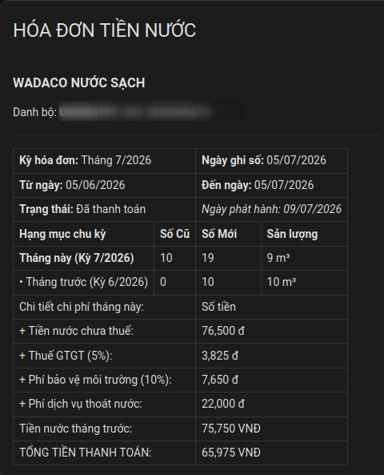
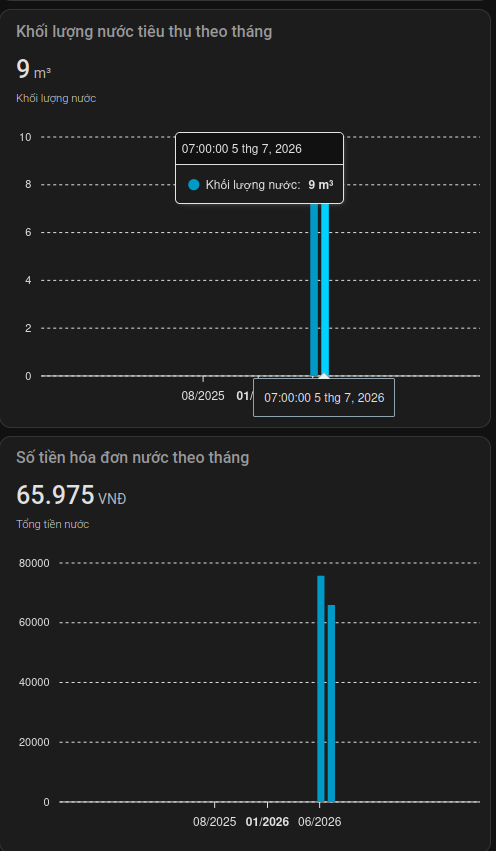

[![hacs][hacs-badge]][hacs-repo]
[![Project Maintenance][maintenance-badge]][maintenance]

## Công cụ theo dõi nước sạch Wadaco cho HomeAssistant

Integration này lấy dữ liệu tiêu thụ nước và hóa đơn từ cổng chăm sóc khách hàng **Wadaco** (`cskh.wadaco.com.vn`) để hiển thị trực tiếp trên UI [Home Assistant](https://www.home-assistant.io), không cần đăng nhập lại trên web mỗi khi muốn xem chỉ số hoặc hóa đơn.

### Các tính năng

1. Thiết lập **một bước duy nhất** — mã chi nhánh + mã khách hàng + mật khẩu.
2. Theo dõi **nhiều mã khách hàng** đồng thời.
3. Lấy **lịch sử hóa đơn/chỉ số của năm hiện tại**.
4. **Chu kỳ cập nhật tùy chỉnh** từ 1 đến 48 giờ, mặc định **12 giờ** — cao hơn nhiều so với các integration điện (thường 3 giờ) vì chỉ số nước chỉ được nhân viên ghi tay **một lần mỗi tháng, thường vào ngày 4-6**, nên không cần lấy dữ liệu thường xuyên hơn.
5. Có thể đổi chu kỳ cập nhật sau khi cài đặt mà không cần xóa integration.

### Sensors được tạo

Entity ID có dạng `sensor.{ma_khach_hang}_{key}` (viết thường).

| Sensor | Ý nghĩa | Đơn vị |
|---|---|---|
| `water_consumption` | Tiêu thụ nước của kỳ hóa đơn gần nhất | m³ |
| `meter_index` | Chỉ số đồng hồ nước mới nhất ★ | m³ |
| `bill_amount` | Số tiền hóa đơn nước gần nhất ★ | VNĐ |
| `payment_status` | Tình trạng thanh toán hóa đơn gần nhất | — |
| `from_date` | Ngày đầu kỳ hóa đơn gần nhất | — |
| `to_date` | Ngày chốt số (ghi số) gần nhất | — |
| `latest_update` | Thời điểm cập nhật dữ liệu lần cuối | — |

> ★ Sensor có **attributes mở rộng** — xem chi tiết bên dưới.

### Attributes mở rộng

**`water_consumption`**: `history` (tiêu thụ từng kỳ trong năm hiện tại, mỗi phần tử có đầy đủ các trường như `bill_amount` bên dưới).

**`meter_index`**: `old_index` (chỉ số đầu kỳ), `meter_no` (số serial đồng hồ), `history` (danh sách các kỳ trong năm hiện tại).

**`bill_amount`**: `period`, `invoice_no`, `invoice_series` (số ký hiệu hóa đơn), `meter_no`, `old_index`, `new_index`, `consumption_m3`, `from_date`, `to_date`, `read_date`, `invoice_date` (ngày lập hóa đơn), `detail_items` (chi tiết đơn giá theo từng bậc: `name`, `quantity`, `unit_price`, `amount`), `amount_before_fees` (tiền nước trước phí), `vat_rate`, `vat`, `environment_fee_rate`, `environment_fee` (phí bảo vệ môi trường), `wastewater_fee` (phí thoát nước), `total_amount`, `total_amount_words` (số tiền bằng chữ), `paid`, và `history` (toàn bộ hóa đơn trong năm hiện tại, mỗi phần tử có đầy đủ các trường trên) — đủ thông tin cơ bản để render lại một hóa đơn.

### Dashboard mẫu (charts)

Thư mục [`charts/`](charts/) chứa một mẫu dashboard dạng YAML (`wadaco_dashboard.yaml`) hiển thị hóa đơn và biểu đồ tiêu thụ nước theo tháng, dựa trên attribute `history` của sensor `meter_index`.

**Yêu cầu:** cài thêm [apexcharts-card](https://github.com/RomRider/apexcharts-card) qua HACS (Frontend) trước khi dùng.

**Cách dùng:**
1. Mở dashboard cần thêm → **Chỉnh sửa** → **⋮** → **Chỉnh sửa bằng YAML**.
2. Dán nội dung file [`charts/wadaco_dashboard.yaml`](charts/wadaco_dashboard.yaml) vào.
3. Thay tất cả `CUSTOMER_CODE` bằng mã khách hàng của bạn (ví dụ `000065191` — trùng với phần `{ma_khach_hang}` trong entity ID, xem [Sensors được tạo](#sensors-được-tạo)).
4. Lưu lại.

Kết quả gồm 2 khối:

| Thẻ hóa đơn chi tiết | Biểu đồ tiêu thụ & tiền nước theo tháng |
|---|---|
|  |  |

## Yêu cầu trước khi cài đặt

### Tài khoản trên cổng CSKH Wadaco

Vào [cskh.wadaco.com.vn](https://cskh.wadaco.com.vn/gcare-mainlogin/) và đăng nhập thử để lấy:
- **Mã khách hàng** (`customer_code`) — có trên hóa đơn nước hàng tháng.
- **Mật khẩu** tài khoản đã đăng ký.

> Mã chi nhánh quản lý (`org_code`) mặc định là **Wadaco** (`CN0181`) trong form thiết lập — chỉ cần đổi nếu tài khoản của bạn thuộc chi nhánh khác (chọn trong danh sách hoặc tự nhập).

## Cài đặt

### Cách 1: Thêm nhanh qua HACS (khuyến nghị)

[](https://my.home-assistant.io/redirect/hacs_repository/?owner=mkbyme&repository=ha-wadaco-water&category=integration)

Sau khi tải xong, **khởi động lại HomeAssistant**, rồi tiến hành [Thiết lập](#thiết-lập) phía dưới.

---

Hoặc thêm thủ công:
> HACS > Integrations > ⋮ > Custom repositories > `https://github.com/mkbyme/ha-wadaco-water` > Category: Integration

### Cách 2: Cài đặt thủ công qua Samba / SFTP

1. Tải phiên bản mới nhất từ [GitHub Releases](https://github.com/mkbyme/ha-wadaco-water/releases).
2. Sao chép thư mục `custom_components/wadaco_water` vào thư mục `custom_components` của HomeAssistant.

    ```
    └── configuration.yaml
    └── custom_components
        └── wadaco_water
            └── __init__.py
            └── sensor.py
            └── wadaco_water.py
            └── config_flow.py
            └── const.py
            └── types.py
            └── manifest.json
            └── ...
    ```

3. Khởi động lại HomeAssistant.

## Thiết lập

[](https://my.home-assistant.io/redirect/config_flow_start/?domain=wadaco_water)

Hoặc tìm thủ công: **Settings > Devices & Services > Add Integration** → tìm `Wadaco Nước Sạch`.

Điền thông tin trong **một bước duy nhất**:
- **Mã chi nhánh**: mặc định **Wadaco** (`CN0181`) — chọn giá trị khác trong danh sách hoặc tự nhập nếu cần
- **Mã khách hàng**: mã khách hàng nước (ghi trên hóa đơn)
- **Mật khẩu**: mật khẩu tài khoản CSKH Wadaco
- **Chu kỳ cập nhật dữ liệu**: số giờ giữa các lần lấy dữ liệu (1–48, mặc định 12)

Sau khi xác nhận, các sensors sẽ xuất hiện trong phần Devices.

### Thay đổi chu kỳ cập nhật sau khi cài đặt

Vào **Settings → Devices & Services → Wadaco Nước Sạch → Configure** để chỉnh lại chu kỳ mà không cần xóa và cài lại integration.

[hacs]: https://github.com/custom-components/hacs
[hacs-badge]: https://img.shields.io/badge/HACS-custom-0468BF.svg?style=for-the-badge
[hacs-repo]: https://github.com/mkbyme/ha-wadaco-water
[maintenance-badge]: https://img.shields.io/badge/maintainer-%40mkbyme-F2994B?style=for-the-badge
[maintenance]: https://github.com/mkbyme
